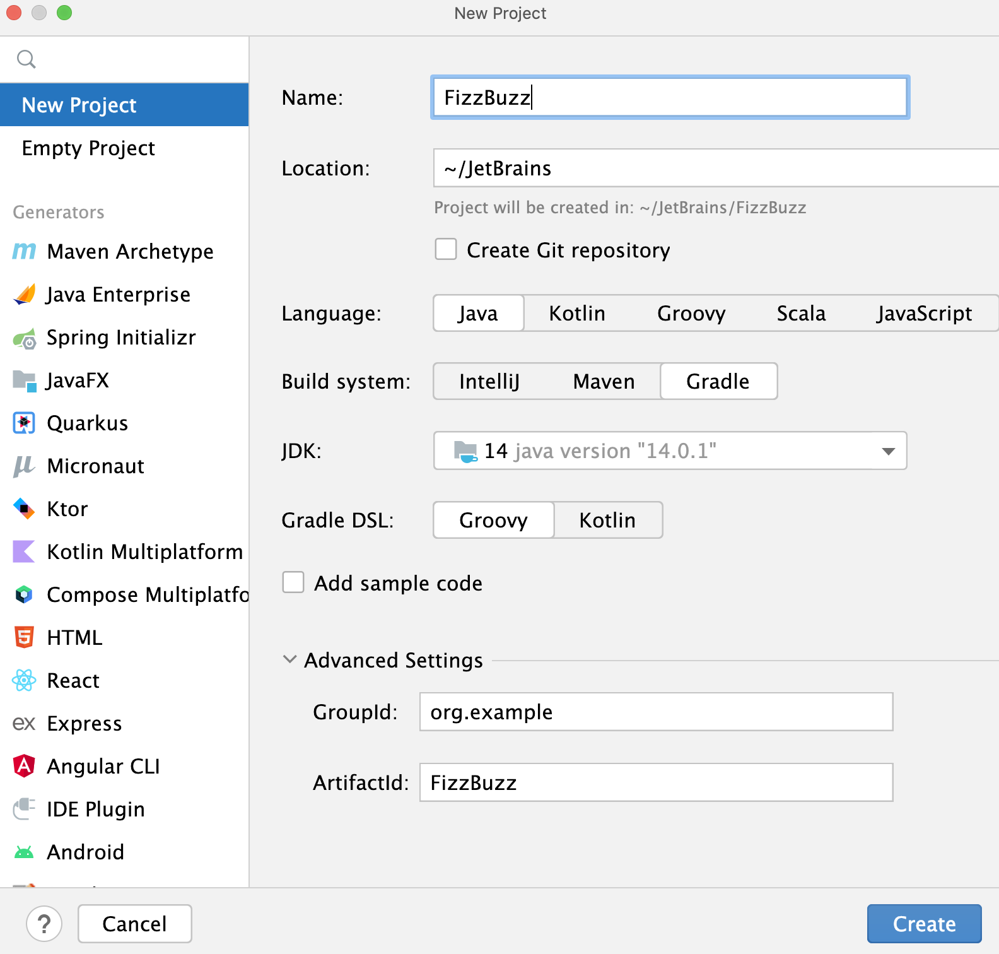
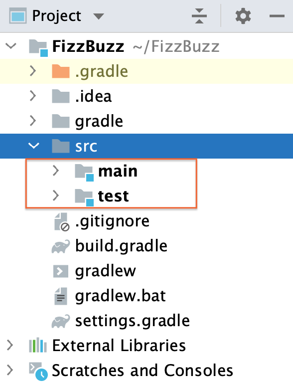
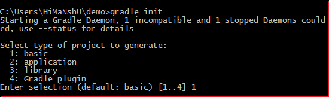
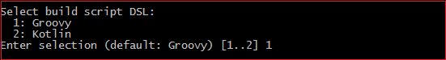
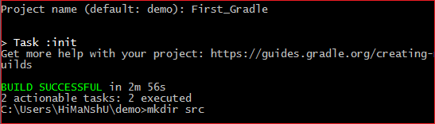
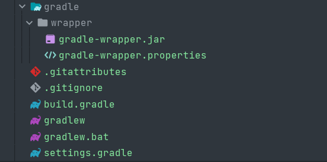
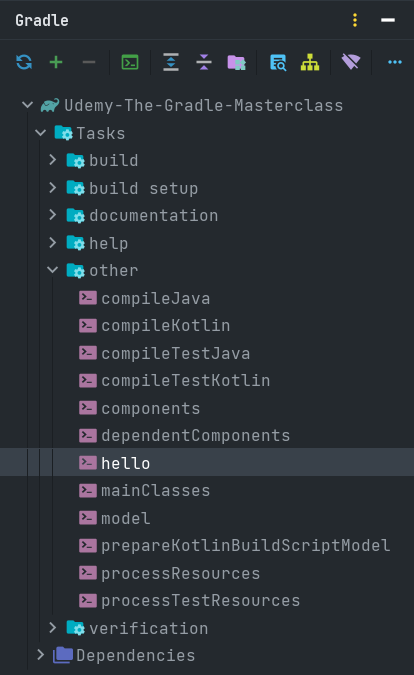

Full guide to installing JDK on your desktop can be found
at https://docs.oracle.com/en/java/javase/11/install/overview-jdk-installation.html

IntelliJIdea Installation guide https://www.jetbrains.com/help/idea/installation-guide.html

The reason we need to install JDK and IntelliJIdea is that in the future we will write a regular java web application.

To meet the minimum requirements necessary to start the build, we must create a build.gradle file.


There are several ways to get started with gradle in your project.

1) **Creating a project using IntelliJIdea** specifying that the build happens through the gradle script.
   On the welcome screen, click New Project.  On the page that
   opens, let's specify our project's
   name (FizzBuzz) and the location. Let's select the Java option, which is what we need for our project and Gradle
   since we are creating a Gradle project. IntelliJ IDEA automatically adds a project SDK (JDK) in the JDK field. In our
   tutorial we use the open JDK 14 version. You can change the selected JDK, IntelliJ IDEA will download the appropriate
   Gradle version. The only thing you need to have is the internet connection. Let's leave the default Groovy for Gradle
   DSL and unselect the Add sample code option since we're going to add our own code from scratch. We can use the
   default information for ArtifactId which basically is the name of our project and leave the default
   information in the GroupId field. Click Create. After we've created our project, and it finished indexing, let's see
   what is inside:
   IntelliJ IDEA creates a project with the build.gradle file including the following code:

```groovy
plugins {
    id 'java'
}

group 'org.example'
version '1.0-SNAPSHOT'

repositories {
    mavenCentral()
}

dependencies {
    testImplementation 'org.junit.jupiter:junit-jupiter-api:5.7.2'
    testRuntimeOnly 'org.junit.jupiter:junit-jupiter-engine:5.7.2'
}

test {
    useJUnitPlatform()
}
```

As you can see, IntelliJ IDEA conveniently adds a test dependency. IntelliJ IDEA supports code completion inside the
build.gradle file. So, if we decide to add more dependencies, IntelliJ IDEA will quickly locate their names and
versions. IntelliJ IDEA also creates the src folder with main and test subdirectories in the Project tool window.



2) **build project with gradle command line**:

To generate a Gradle project, run the gradle init command. It will generate a simple project. With this project, we will
explore and understand everything that is generated. When we run the gradle init command, it will ask for some basic
requirements. First, it will ask the type of project that we want to create. It will give four options:

```shell
1: basic  
2: application  
3: library  
4: Gradle plugin  
```

Select our requirements. Hence, we are just making a demo project so that we will select the basic option. To select
basic option, press 1 and Enter key. Consider the below output:


Next, it will ask for **DSL**. There are two options that are available for DSL:

```shell
1: Groovy  
2: Kotlin  
```

Groovy is the default DSL provided by Gradle. Select build script DSL.


Next, it will ask for the **project name**. Type the project name and press Enter key. It will take a while to build a
project. After the successful execution of the project, we will get a message **BUILD SUCCESSFUL**.


Now we have successfully created a Gradle project. Now, what will happen to our specified directory? Consider the below
structure of the Gradle project. 

It is the default structure of a Gradle project. Gradle will generate the following things for us:

- The **gradle** file is build script for configuring the current project.
- An **executable JAR** file is used as a Gradle wrapper. 
- **Configuration properties** for Gradle Wrapper. 
- The **gradlew** is a Gradle wrapper script for UNIX based OS.
- The **bat** is the Gradle Wrapper script for Windows.
- **The settings script** for configuring the Gradle build.

3) Adding Gradle to an Existing Project:

Step 1 Add: build.gradle file in your root project folder, and use plugin for example:
```groovy
apply plugin: 'idea'
apply plugin: 'java'
```

and with this fire from command line:

```shell
gradle cleanIdea 
```

and after that:
```shell
gradle idea
```
After that everything should work.

Everything in the build.gradle file is a script based on the groovy or kotlin language.

Let's add the simplest task for the script
_groovy_
```groovy
tasks.register("hello") {
   doLast {
      println("Hello world")
   }
}
```
_kotlin_
```kotlin
task("hello").doLast {
    println("Hello world")
}
```

After we have added a new task, we can find it in the gradle menu under the other section.


You can execute it from this menu or using the command line:
```shell
gradle hello
```

The result will be:
```shell
Starting a Gradle Daemon (subsequent builds will be faster)

> Task :hello
Hello world

BUILD SUCCESSFUL in 27s
1 actionable task: 1 executed
PS C:\FLO-LIVE\2023\Udemy-The-Gradle-Masterclass> 

```