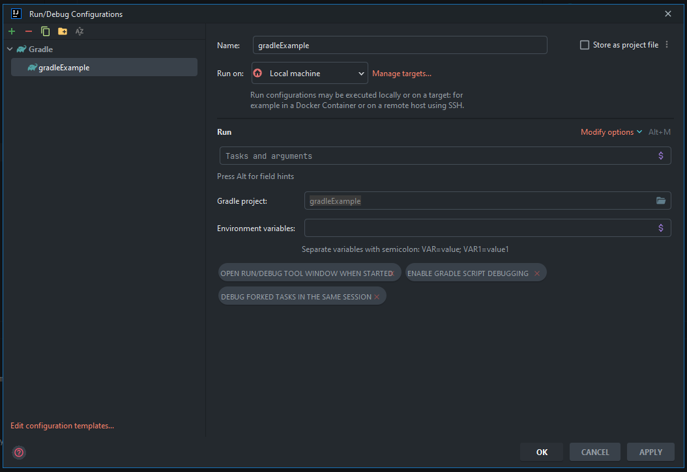

Writing build scripts is very easy.
First of all, we need to open the build.gradle file and this is the home for most of our build scripts.
In order to run this, we need to actually create a run configuration, as we did in the previous tutorial.

After creating the project through the console, we get an empty build.gradle file.
To demonstrate that the `build.gradle.kts` file is a gradle script, simply print out Hello World

After adding this project in the launch configuration,



we can run the script itself and see this message in console

```shell
> Configure project :
Hello World

> Task :help

Welcome to Gradle 7.6.

To run a build, run gradle <task> ...

To see a list of available tasks, run gradle tasks

To see more detail about a task, run gradle help --task <task>

To see a list of command-line options, run gradle --help

For more detail on using Gradle, see https://docs.gradle.org/7.6/userguide/command_line_interface.html

For troubleshooting, visit https://help.gradle.org

BUILD SUCCESSFUL in 100ms
1 actionable task: 1 executed
23:34:26: Execution finished.
```

We've executed our great script and you can see the world being output to the console just like it would be with Java.
The fact is that Kotlin and groovy are 99% compatible with Java.

We can verify this statement simply by trying the Java API when working with the date format.

```kotlin
import java.text.SimpleDateFormat
import java.util.*

val sdf = SimpleDateFormat("yyyy-MM-dd'T'HH:mm:ss'Z'")
sdf.timeZone = TimeZone.getTimeZone("UTC")
println("Hello World " + sdf.format(Date()))
```

After running the script, we get the following result in the console:

```shell
Hello World 2023-04-17T20:45:44Z
```

So, scripts play a really important role in gradle and groovy or kotlin backing scripts, in java, or should the code be
packaged in classes with a static main method as entry point? Well, in Groovy or Kotlin you can script. Scripts
themselves can contain Method classes, variables, inline code.

And here is an example of some lines of code.

```kotlin
//inline code example
fun sayHalloWorld() {
    println("Hello World ")
}

//And then we can just call that method by actually calling it like we would do in Java with hello
sayHalloWorld()
```

In the end, our build.gradle.kts will look like this:

```kotlin
import java.text.SimpleDateFormat
import java.util.*

val sdf = SimpleDateFormat("yyyy-MM-dd'T'HH:mm:ss'Z'")
sdf.timeZone = TimeZone.getTimeZone("UTC")
println("Hello World " + sdf.format(Date()))

//inline code example
fun sayHalloWorld() {
    println("Hello World ")
}
//And then we can just call that method by actually calling it like we would do in Java with hello
sayHalloWorld()
```

And when running the script in the console, we will get the following result:

```shell
Hello World 2023-04-17T20:53:39Z
Hello World 
```

Another interesting thing is where you can call methods from. Even if we swap the definition of the method and its call,
the result of the execution will be the same. This is because Gradle actually parses the entire build script before
calling any methods.

In groovy, the actual return statement is optional,

```groovy
int doubleInt(Integer i) {
    i * 2
}
```

and here in the double method the return statement is generally left out. If there is more than one line in the method,
the value of the last line is returned.

```groovy
def doubleInt(Integer i) {
    println(i)
    i * 2
}

println doubleInt(6)
```

result is:

```shell
6
12
```

In Kotlin, you need to specify what the method returns or use the expression
body style in the method

```kotlin
fun doubleInt(i: Int): Int {
    return i * 2
}

// or
fun doubleInt(i: Int): Int = i * 2
```

## Typing in Groovy and Kotlin ##

Groovy is not a strongly typed language, which means we can actually use typing or not.
The choice is ours, so things like variables, parameters, and return values can be type-specified or not or a mixture of
both.

Groovy uses the def keyword to declare a variable. So you can keep in mind that the keyword def is synonymous with an
object in Java, so if you take, for example, declaring an object variable in Java is the same as declaring a variable
with the key word def in groovy.

For example:

```java
Object date = new Date();
```

likewise

```groovy
def date = new Date()
```

In the example earlier on groove in the method, we used keyword `def`

```groovy
def doubleInt(Integer i) {
    println(i)
    i * 2
}
```

we can replace it with an integer.

```groovy
Integer doubleInt(Integer i) {
    println(i)
    i * 2
}
```

There is a rule according to which if we have defined the type of variable, we cannot change it (for example, replace
Integer with a String), this rule is taken by analogy from Kotlin for example if we try in doubleInt method to pass a
string we get an error, because we have specified the type of input parameter.

```groovy
int doubleInt(Integer i) {
    println(i)
    i * 2
    return x = i + "6"
}

println doubleInt(6)
```

result:

```shell
A problem occurred evaluating root project 'gradleExampleGroovy'.
> Cannot cast object '66' with class 'java.lang.String' to class 'int'
```

So we don't actually realize there's a problem until we actually run the code or the script now. With the introduction of
Kotlin Integrate, all this makes things a little different because the actual type checking is done at compile time,
and we'll be looking at that further.