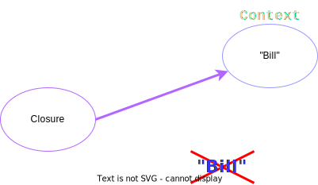

#### Features of working with strings in groovy

- In groovy, no character literals like in Java.
- String can be enclosed in double or single quotes.

```groovy
def s1 = "a string"
print s1

def s2 = 'a string'
print s2

```

- Groovy has a really nice way to work with multi-line strings using three double quotes.

```groovy
def s3 = """ A
            string
            on
            multiple
            lines
"""
print s3
```

- Groovy supports string interpolation, which basically means something like if we had a variable, say variable X, and
  we assign integer four, but we want to use that integer in our string, we can do this using dollar sign '$' like.

```groovy
def s4 = 4
print "x = $s4"
```

So we have X is X, and then when we run that, you'll notice that in the line, the total number of X's has been
replaced with a variable value of four. In the Java world, this is called interpolation. You will need to combine them.
In Groovy, you're not just limited to using variables, you can interpolate code as well, and you can do
that using the dollar sign and curly braces. And inside the curly braces, you put the code you really want to run.

- In Groovy you aren't limited to using variables, you can interpolate code as well, and you can do that using the
  dollar sign and curly braces.
  And inside the curly braces, you put the code you really want to run.

```groovy
def myCourses = 'Groovy'
println "I`m traning in: ${myCourses.toUpperCase()}"
```

`⚠️ IMPORTANT ⚠️ String interpolation only works when double quotes are used.`

## Properties in groovy

getter and setter

In groovy, getters and getters don't need to be created. We just create instance variables, and they're basically
wrapped for us with getters and setters. So we don't really need to implement this code.

So this example, we've got the class person that has two instance variables of name and age.

```groovy
class Person {

    String name
    Integer age

    Person(name, age) {
        this.name = name
        this.age = age
    }
}

def p1 = new Person(Alex, 36)
println p1.age
```

```shell
36
```

```groovy
p1.age = 37
println p1.age
```

```shell
37
```

Now you notice there are any getters and setters, and that's because groovy implements those for us behind the scenes.
So it looks like we got direct access to the instance variables, but we're actually going via getters and setters.
And that's what makes these attributes on person properties rather than just instance variables.

We really start to see the power of properties and groovy when we start using collections such as hash maps.
Getting and setting on a hash map is done using the keys, which are represent properties and groovy.
So let's have a look at this example.

We create a new hash map.

And we can, as we do in Java, use the put method, so putting the key food with the value of Fred

into the Hashmap program to get the value of food we use to get maced on the Hashmap, and we pass in the Key foo.

```groovy
Map m = new HashMap()
m.put("foo", "Fred")
println m.get("foo")
```

result:

```shell
Fred
```

And if we try that by just printing it to the console, that's exactly what we get. But we're using the property syntax.
The actual key becomes a property. So we can reference that by using the adult notations, reading dot food, which is
seen as a property.

```groovy
//Setters example
m.foo = "Bill"
m.bar = "Jane"
m.baz = "Dave"
```

```groovy
//getter example as property style
println m.foo
println m.bar
println m.baz
```

result:

```shell
Bill
Jane
Dave
```

I'm assigning that the value of Bill, and we can do the same with a couple more. We can use bar and
bars and assign those keys the value of Jane and Dave and to actually get those values, we use that dot notation as
well.

### Closure

One of the significant aspects of the Groovy language is the use of closures.

Closures in Groovy have a syntax similar to lambda expressions in Java 8, and are declared using a pair of curly braces.

You can assign a closure to a variable, like a value:

```groovy
def echoIt = {}
println echoIt()
```

Here, we assign a closure definition to the variable `echoIt`.
To run or evaluate the closure, we use the open and close parentheses.
In this case, the result is null because there are no contents within our closure.

```shell
null
```

If we leave off the parentheses, we can actually print the closure's `toString()` method:

```groovy
def echoIt = {}
println echoIt
```

```shell
build_$ndjqumb0ydmnqbo9w2daz7q5$_run_closure1@431ab292
```

This output is a long, meaningless name, but it shows that we're not evaluating the closure but rather calling the
`toString()` method on the closure itself.
You can think of closures as almost as anonymous inner classes in Java.

Let's add some code to our closure, for example, printing "Hello, world":

```groovy
def echoIt = {
    println "Hello world"
}
println echoIt()
```

Closures always return the value of the last statement, similar to methods.
In this case, the last statement is `println`, which doesn't return a value, so the default value returned is null.

```shell
Hello world
null
```

We can also pass parameters into a closure using the forward arrow syntax (->):

```groovy
def echoIt = { parameter ->
    println parameter
}

echoIt("Hello world")
```

Like methods in Groovy, closure parameters can also have types:

```groovy
def echoIt = { String parameter ->
    println parameter
}

echoIt("Hello world")
```

However, since Groovy performs type checking at runtime, not at compile time, a type mismatch would result in an
exception:

```groovy
def echoIt = { Integer parameter ->
    println parameter
}

echoIt("Hello world")
```

```shell
FAILURE: Build failed with an exception
```

A closure with no declared parameters implicitly takes an untyped parameter named `it`:

```groovy
def echoIt = { println it }

echoIt("Hello world")
```

```shell
Hello world
```

Closures can also accept any number of arguments:

```groovy
def echoIt = { a, b, c ->
    println a
    println b
    println c
    4
}

echoIt("Hello world", "how are you?", "today!")
```

```shell
Hello world
how are you?
today!
4
```

When defining a variable with a closure, we can use the `def` keyword as its type, which is similar to the Java `Object`
type. Alternatively, we can use the `Closure` type for more specificity:

```groovy
Closure echoIt = { a, b, c ->
    println a
    println b
    println c
    4
}

echoIt("Hello world", "how are you?", "today!")
```

Using the `Closure` type is especially useful when you want to pass closures to methods.

OK, in this tutorial, we'll continue looking at closures in more detail, particularly focusing on passing closures as
parameters to methods. We'll also examine the special syntax needed when there's more than one parameter being passed to
a method. Finally, we'll look at the code block design pattern, which is frequently used within Gradle.

Let's start by looking at how we can pass a closure to a method as a parameter:

```groovy
def oneArgMethod(closure) {
    closure() * 2
}
```

Here, we define a method called oneArgMethod that accepts one parameter, a closure. The method implementation is simple:
it multiplies the result of running the closure by two. We invoke the closure and then multiply the result by two. The
last statement in the method returns the result automatically.

Calling the method itself is like calling any other method:

```groovy
println oneArgMethod({ 10 })
```

result

```shell
20
```

The syntax changes slightly when we have two arguments passed as parameters to our method:

```groovy
def twoArgMethod(factor, closure) {
    closure() * factor
}

println(twoArgMethod(3, { 10 }))
```

Instead of hardcoding the factor 2 into our method, we pass it in as a parameter. When more than one argument is passed
into a method and one of them is a closure, the closure is always the last argument. This allows us to leave out the
parentheses around the closure:

```groovy
twoArgMethod 3, { 10 }
```

Closures don't need to be a single line of code; they can contain multiple lines of code:

```groovy
def i = oneArgMethod(closure) {
    def y = 3
    y * 2
}
```

Here, the closure passed into oneArgMethod is a multiline closure, and i should equal 12.

Creating, passing, and manipulating closures as parameters to methods is a popular pattern called a code block, which is
used extensively in Gradle.

Let's compare two techniques for iterating through a collection:

```groovy
//common uses of closure iterator
for (int j in [1, 2, 3]) {
    println j
}
```

This is the traditional way, using a for loop as in Java. We iterate over an array of numbers and print each number. In
Groovy, it's different:

```groovy
[1, 2, 3].each {
    println it
}
```

We have a collection with an each method that accepts a closure as an argument. The closure is called once for each
item, passing the item to the closure as the argument. This approach is more object-oriented than the standard for loop.

So, to recap, we've looked at passing closures as parameters to methods, the special syntax when multiple parameters are
passed to a method, and the code block design pattern.

## Closure Resolution in Groovy

In this chapter, we'll explore closure resolution in Groovy and discuss what it means when a closure is closed over a
context. We'll examine an example to understand this concept better.

Consider the following `Person` class with a `name` property and a `nameSayer` closure:

```groovy
class Person {
    String name = "Alex"

    Closure nameSayer = {
        println name
    }
}

def p1 = new Person()
```

The `nameSayer` closure is an instance variable of type `Closure`, and its default code block prints the `name` to the
console. We can create a new instance of the `Person` class, reference the `nameSayer` closure, and evaluate it like a
normal method.

Closures keep a reference to the context in which they are defined. For example, consider the following code:

```groovy
class Person {
    String name = "Alex"

    Closure nameSayer = {
        println name
    }
}

def p1 = new Person()
p1.nameSayer()

def theName = "John"

def sayName = {
    println theName
}

sayName()
```

When we run the code, we'll see the following output:

```shell
Alex
John
```

Now, if we change the value of the `theName` variable to "Bill", the output will change accordingly:

```groovy
class Person {
    String name = "Alex"

    Closure nameSayer = {
        println name
    }
}

def p1 = new Person()
p1.nameSayer()

def theName = "John"

def sayName = {
    println theName
}

sayName()

theName = "Bill"

sayName()
```

The output will now be:

```shell
Alex
John
Bill
```

Closures keep a reference to the context object in which they are defined, not the values themselves. As the content of
the variable changes, the closure's result also changes when it is evaluated. This behavior occurs because closures
maintain a reference to the context in which they are defined, rather than the values themselves.


The main idea to remember here is that when the context is updated and the closure runs again, it will run against the
new values actually held in the context.

This concept is also heavily used in JavaScript and is key to understanding how Gradle uses Groovy as its default
scripting language.

The context is also known as the owner object.

The concept of the context within a closure is critical to understanding how Gradle and Groovy work together.

When working with Gradle and Groovy, you'll often hear about a delegate object.

The delegate object is just another Groovy term for the context with which the closure actually runs against.

Now, in my Person class, I've created a new method called `executeInside`,
which takes a parameter in the form of a closure.

```groovy
class Person {

    String theName
    Integer theAge

    Person(String theName, Integer theAge) {
        this.name = theName
        this.age = theAge
    }

    def executeInside(Closure c) {
        c.delegate = this
        c()
    }
}
```

On the first line of the method, you can see that I'm referencing the delegate property, which is actually a property of
the closure.

Now, I'm assigning this value using the keyword this, which equates to the instance of the Person class.

After setting this property, I then call or evaluate the closure by calling it using round brackets.

What does this actually mean?

```groovy
def p1 = new Person("Fred", 35)

println p1.theName
```

```shell
Fred
```

It means that we can create a new Person object and execute an arbitrary block of code using the object and having
access to the instance variables of the object.

If you think about it, this is a very powerful concept because now we can add arbitrary code to a class without changing
the class itself.

```groovy
def p1 = new Person("Fred", 35)

//println p1.theName

p1.executeInside { println theName }
```

It's very useful to know this because this is exactly how Gradle works behind the scenes. In this course, we'll be
looking deeper into this concept as it is essential for understanding how Gradle works at a deeper level.

## Conclusion

So, closures in Groovy are a powerful tool that allows us to add arbitrary code to a class without changing the class
itself. This is a key concept for understanding how Gradle works with Groovy. By using closures and delegates, we can
manipulate and execute code within a specific context, having access to the variables and methods of the owner object.
Knowing how closures and delegates work will help you better understand and utilize the capabilities of Gradle and
Groovy in your projects.
